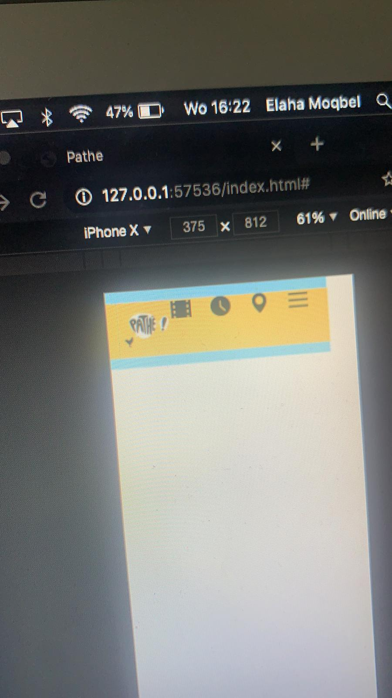
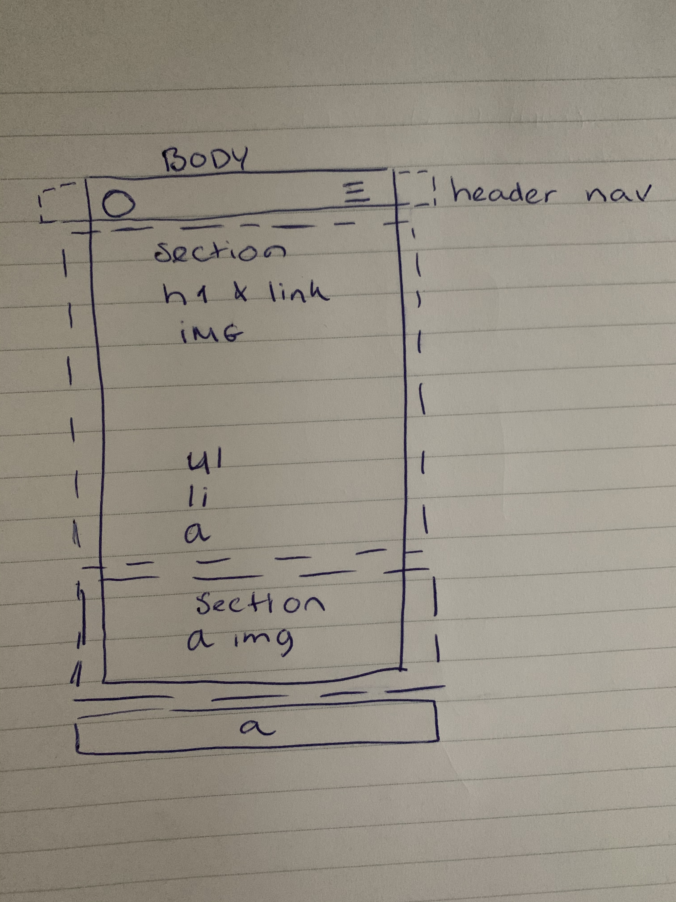

# Procesverslag
**Auteur:** -Elaha Moqbel-

Markdown cheat cheet: **[Hulp bij het schrijven van Markdown](https://github.com/adam-p/markdown-here/wiki/Markdown-Cheatsheet). Nb. de standaardstructuur en de spartaanse opmaak zijn helemaal prima. Het gaat om de inhoud van je procesverslag. Besteedt de tijd voor pracht en praal aan je website.**

## Bronnenlijst
1. -youtube.com-
2. -de lessen en oefeningen-
3.-https://fontawesome.com/icons/star?style=solid-
4. -google.com-

## Eindgesprek (week 7/8)

-dit ging goed: Het geen wat ik tot nu toe heb ziet er wel verzorgd uit en ik begrijp het ook.  

dit was lastig: De website is nog lang niet compleet. Ik maak een plan om nog een footer te maken op de eerste pagina en dan bezig te gaan met de tweede pagina. -

**Screenshot(s):**

-screenshot(s) van je eindresultaat-

## Voortgang 3 (week 6)

### Stand van zaken

-dit ging goed: De knoppen en de tekst kreeg ik op de afbeelding. Dit lukte eerst niet omdat de afbeelding boven op die elementen lag. 

dit was lastig: Ik liep vast omdat ik een slider wilde maken maar dit was te ingewikkeld. ik had ook nog niet een goed beeld van hoe ik mijn tweede pagina moest indelen. -

![alt text][screenshot_probleem]

### Verslag van meeting

-conclusie van deze meeting:
Zonder een plan en doel voor ogen ben ik veel langzamer bezig dan als ik dat wel heb. Hier liep ik beetje tegen aan met de tweede pagina. Ik wil mezelf het ook steeds moeilijker maken dan nodig is. 

## Voortgang 2 (week 5)

### Stand van zaken

-dit ging goed: het maken van de menu gaat makkelijker met behulp van een website waaruit ik gelijk iconen kan halen. 

dit was lastig: Aan de rechter kant van de website bleef er maar een leeg stukje wat ik niet weg kreeg. Het bleek dat een element een te grootte waarde had. 

![alt text][screenshot_probleem]

### Verslag van meeting

-conclusie van deze meeting was dat ik niet te lang moet stil staan bij die kleine problemen. Ik moet leren om de hoop niet op te geven en op tijd hulp te vragen.

## Voortgang 1 (week 3)

### Stand van zaken

-dit ging goed: Voor het eerste lukte het om probelem zelf op te lossen, in plaats van iemand anders te laten proberen en alleen mee te kijken. 

dit was lastig: Het lukte maar niet om de navigatie balk over de hele breedte te weergeven.-

-screenshot(s) van hoe ver je bent-

### Verslag van meeting

-conclusie van deze meeting:
Alles gaat nog stroef. Ik vind het lastig en kom niet goed vooruit met de website. Als tip kreeg ik mee om een andere website te kiezen. Dit werd videoland.nl-

## Intake (week 1)

**Je startniveau:** -blauw-

**Je focus:** -surface plane-

**Je opdracht:** [Pathe](https://www.pathe.nl)

**Screenshot(s):**

**Breakdown-schets(en):**

